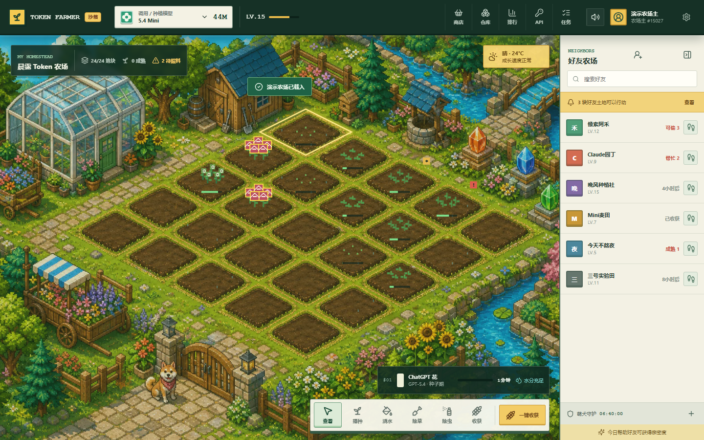
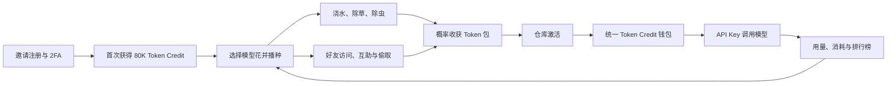
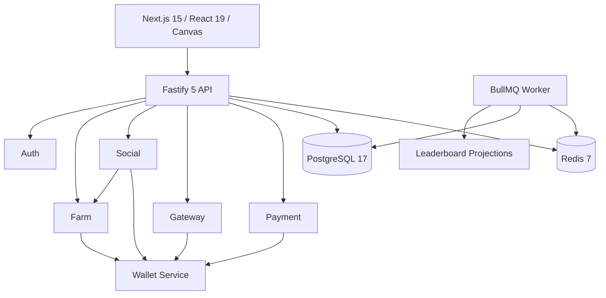

<div align="center">

# Token Farmer

**把 AI Token 种成一座会生长的像素农场。**

一个面向电脑浏览器的邀请制多人农场：种下模型花、维护土地、收获 Token 包，
再用同一份 Token Credit 调用模型。好友可以互助，也可能来你的农场碰碰运气。

[](#当前状态)
[](#快速开始)
[](./package.json)
[](./package.json)
[](./tsconfig.base.json)

[在线试玩](http://1.15.179.90) · [玩法规格](./docs/specs/gameplay.md) · [经济规格](./docs/specs/economy.md) · [架构文档](./docs/architecture.md)

公开预览邀请码：`TOKEN-FARMER-ALPHA`

</div>



> 当前链接是邀请制 Mock 沙箱，只用于体验和工程验证。Token 不可提现、交易或转账，
> 上游模型与支付均未切换为公开生产服务。

## 它有什么不同

Token Farmer 不是给管理后台套一张农场皮肤。游戏资源、模型调用与账本共享同一套服务端规则：

- **统一 Token Credit**：一个余额支持允许目录内的不同模型，不再按厂商拆成多份零钱包。
- **模型长成花**：ChatGPT、Claude、Gemini、DeepSeek 等模型身份会成为花朵的像素外观与审计元数据。
- **真实农场循环**：播种、浇水、除草、除虫、成熟、收获、Token 包激活形成完整闭环。
- **概率不是固定百分比**：收获和偷取由版本化规则、作物状态、亲密度、守护状态与确定性随机输入共同结算。
- **游戏外仍然有用**：激活后的 Token Credit 可由同一个 `sk-tf-...` Key 在沙箱模型网关中消费。
- **账务可以追溯**：余额只允许通过 Wallet Service 与追加式账本变化，奖励和回调可幂等重放。

## 核心玩法

| 系统     | 当前能力                                                                 |
| -------- | ------------------------------------------------------------------------ |
| 账号     | 邀请码注册、邮箱验证、密码登录、TOTP 2FA、30 天安全会话、退出失效        |
| 新手奖励 | 首次成功登录一次性获得 `80,000` Token Credit，并发或重复登录不会重复发放 |
| 农场     | 24 格固定土地、15 级花种、免费新手花、成长事件、维护、批量收获与仓库激活 |
| 模型花   | 使用模型/厂商像素标志作为花冠，花茎、叶片和根部与真实地块绑定            |
| 社交     | 好友码、申请与接受、访问好友农场、互助、亲密度、概率偷取与萌犬守护       |
| 排行榜   | Token 收获榜、API 消耗榜、当前持有榜，支持好友/全服和日/周/总榜视图      |
| 模型网关 | API Key 创建与撤销、统一余额、用量统计、Mock 上游、流式结算边界          |
| 商店     | 花种、萌犬用品、农场装扮与沙箱 Token 购买入口                            |
| 运营     | 版本化价格、概率、成长与守护规则，审计记录和服务健康状态                 |

## 完整闭环



## 像素交互

- 土地点击区域与背景中的真实菱形地块对齐，选中时沿土地边缘发光。
- 播种、浇水、除草、除虫、收获分别使用像素化工具反馈，不以普通鼠标指针代替。
- 好友侧栏可折叠，进入好友农场有明确的加载与到达状态。
- 农场音乐、点击、浇水、收获与守护犬使用独立音效通道，可随时静音。
- 当前仅支持 `1280x720`、`1440x900`、`1920x1080`、`2560x1440` 桌面视口。

## 技术架构



依赖方向固定为：

```text
HTTP / UI -> Application Service -> Domain -> Port
                                            ^
                                  Database / External Adapter
```

每个业务模块拥有自己的逻辑和数据访问。`farm`、`gateway`、`social` 和 `payment`
不能直接修改钱包表，只能调用 Wallet 的公开应用端口。

```text
apps/
  web/            桌面端像素农场
  api/            HTTP 与模型网关组合根
  worker/         队列任务与排行榜投影
modules/
  auth/           账号、邀请、验证与会话
  wallet/         统一钱包、预留、结算与不可变账本
  gateway/        API Key、模型调用与用量
  farm/           土地、作物、成长与收获
  social/         好友、亲密度、互助与偷取
  payment/        沙箱订单、回调与退款状态
  leaderboard/    事件驱动排行榜读模型
  admin/          运营配置与审计入口
packages/         基础类型、契约、UI 与数据库运行时
database/         Schema、迁移与种子数据
infra/            Docker、Caddy 与部署资产
docs/             Spec、ADR、工程规范与运行手册
```

## 快速开始

### 环境要求

- Node.js `22.18+`
- pnpm `10.14.0`
- Docker Desktop 或兼容的 Docker Engine

### 1. 安装依赖

```powershell
corepack enable
corepack prepare pnpm@10.14.0 --activate
pnpm install --frozen-lockfile
Copy-Item .env.example .env
```

`.env.example` 只包含本地占位值。启动 API 前，请将 `.env` 中的变量加载到当前终端；
不要把本地或生产 `.env` 提交到 Git。

### 2. 启动基础设施和数据库

```powershell
pnpm compose:up
pnpm db:migrate
pnpm db:seed
```

开发 PostgreSQL 监听 `127.0.0.1:5433`，Redis 监听 `127.0.0.1:6380`。

### 3. 启动应用

```powershell
pnpm dev
```

默认入口：

- Web：`http://127.0.0.1:3000`
- API：`http://127.0.0.1:4000`
- Ready Check：`http://127.0.0.1:4000/health/ready`

## 质量门禁

核心概率规则是无数据库、无系统时间、无全局随机数的纯函数。时间与随机输入必须显式传入，
因此同一输入能够稳定复现。

```powershell
pnpm format:check
pnpm lint
pnpm architecture:check
pnpm typecheck
pnpm test:unit
pnpm test:property
pnpm test:integration
pnpm test:contract
pnpm db:check
pnpm build
pnpm test:e2e
```

一次运行全部门禁：

```powershell
pnpm verify
```

CI 使用 PostgreSQL、Redis 和 Mock 上游执行格式、Lint、类型、单元、属性、集成、契约、
架构、迁移、生产构建和 Playwright 桌面端冒烟测试。

## 安全与经济不变量

- 金额、Token、产量和积分使用整数或 `bigint`，PostgreSQL 使用 `numeric(38,0)`。
- 所有时间持久化为 UTC，展示边界才转换时区。
- 所有写接口接受 `Idempotency-Key`，财务与奖励写入在事务内强制幂等。
- API Key 完整值只展示一次，服务端只保存前缀和带 Pepper 的哈希。
- 首次奖励、收获、偷取、Token 包激活和 API 结算均由服务端权威校验。
- 真实密钥、支付私钥、证书、数据库备份、日志和模型请求正文不得进入 Git。

详见 [安全规范](./docs/security.md) 与 [工程规则](./AGENTS.md)。

## 当前状态

### 已完成并可验证

- 邀请注册、邮箱验证、TOTP、会话恢复和首次奖励防重复。
- 统一 Token Credit 钱包、追加式账本、预留与结算边界。
- 24 格像素农场、模型花、工具交互、好友访问、偷取与排行榜界面。
- Mock 模型上游、Mock/沙箱支付边界和 API Key 生命周期。
- Docker Compose、Caddy、数据库备份/校验、健康检查与镜像回滚流程。

### 正式开放前仍受限

- 当前公开环境保持邀请制和 Mock 上游。
- 域名、HTTPS 与大陆公开服务需等待 DNS 和适用备案流程完成。
- 正式模型转售和真实支付必须经过授权、风控与单独发布审批。

### 明确不做

- 手机端、小程序和原生客户端。
- 玩家间 Token 转账、市场交易、提现或现金兑换。
- 区块链钱包、NFT 或真实现金随机奖励。
- QQ/微信好友导入、牧场、矿山和大规模聊天系统。

完整边界以 [产品范围](./docs/product-scope.md) 为准。

## 参与开发

1. 先阅读 [AGENTS.md](./AGENTS.md) 和对应的 [功能规格](./docs/specs/)。
2. 一个 PR 只处理一个清晰问题，不混合依赖升级与业务功能。
3. Bug 修复必须增加能在修复前失败的回归测试。
4. 修改模块边界、事务边界或公共契约时同步更新 ADR 与架构文档。
5. 提交前运行与改动类型对应的验证，关键路径运行 `pnpm verify`。

问题与功能建议请通过 GitHub Issues 提交，并写明复现步骤、预期行为和验收条件。

---

<div align="center">

**种下模型，收获 Token。**

Token Farmer 当前处于邀请制沙箱阶段。

</div>
