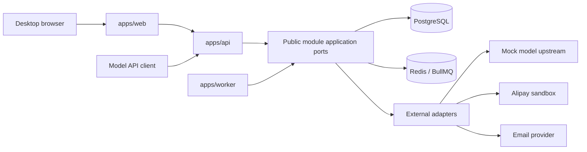

# Architecture

## 形态

第一版采用模块化单体：Web、API 和 Worker 是独立进程，业务模块共同编译但保持数据所有权和公开端口边界。PostgreSQL 是事实来源，Redis/BullMQ 只保存可重建的任务、锁和短期缓存。



API 是 HTTP 组合根，Worker 是异步组合根；它们负责装配 Adapter，不拥有业务规则。Web 只消费 Contracts，不导入服务端模块。

## 模块所有权

| 模块          | 负责                                       | 拥有的数据                                                                 | 可发布的主要事件                             |
| ------------- | ------------------------------------------ | -------------------------------------------------------------------------- | -------------------------------------------- |
| `auth`        | 邀请、账号、邮箱验证、TOTP、会话           | users, invitations, identities, sessions, two_factor                       | `UserVerified`, `UserFrozen`                 |
| `wallet`      | 模型钱包、预留、结算、不可变账本、Token 包 | wallets, reservations, ledger_entries, token_packages, idempotency_records | `WalletEntryPosted`, `TokenPackageActivated` |
| `gateway`     | API Key、兼容请求、用量与上游协调          | api_keys, model_requests, usage_records                                    | `ApiUsageFinalized`, `ApiKeyRevoked`         |
| `farm`        | 土地、作物、成长、维护、随机承诺、收获     | plots, plantings, crop_events, rule_snapshots                              | `CropMatured`, `CropHarvested`               |
| `social`      | 好友、亲密度、帮助、恶作剧、偷取           | friend_requests, friendships, blocks, steal_attempts, helps                | `FriendshipChanged`, `CropStolen`            |
| `payment`     | 商品、订单、回调、查单、退款               | products, orders, provider_callbacks, refunds                              | `OrderPaid`, `OrderRefunded`                 |
| `leaderboard` | 事件消费、榜单投影与快照                   | leaderboard_events, leaderboard_scores, snapshots, privacy_preferences     | `LeaderboardSnapshotPublished`               |
| `admin`       | 管理命令编排和审计查询                     | admin_actions, operational_audit                                           | `AdminActionRecorded`                        |

表名可按数据库命名规范增加模块前缀，但所有权不能改变。模块之外不得导入其 schema 或 repository adapter。

## 模块内部层次

每个 `modules/<name>` 只暴露根 `index.ts`，内部结构如下：

```text
domain/       entities, value objects, policies, pure calculations
application/  use cases and orchestration
ports/        repository and external capabilities required by the module
adapters/     PostgreSQL, Redis, provider, and clock/random implementations
http/         request mapping; no business calculation
index.ts      reviewed public application types and factories only
```

合法依赖：

```text
http -> application -> domain
application -> ports
adapters -> ports + domain
composition root -> http/application + adapters
```

`domain` 不依赖 `application`、`ports` 或 `adapters`。Port 使用领域语言，不泄露 Drizzle 行类型、Fastify Request、Redis 命令或第三方 SDK 类型。

## 跨模块调用

- 调用方只导入目标模块 `index.ts` 暴露的 Application Port 和 DTO。
- 跨模块返回业务结果或稳定错误码，不返回目标模块的内部实体。
- 简单查询优先使用专用读模型；不能通过跨模块 SQL JOIN 绕过所有权。
- 同步调用形成的依赖必须无环。事件用于排行榜、通知等可延迟投影，不能用来完成需要即时原子性的余额结算。

允许的同步业务依赖：

| 调用方        | 可调用                   | 原因                                       |
| ------------- | ------------------------ | ------------------------------------------ |
| `gateway`     | `auth`, `wallet`         | 鉴别 API Key，预留和结算调用费用           |
| `farm`        | `wallet`                 | 校验/扣除播种与维护成本，创建主人 Token 包 |
| `social`      | `auth`, `farm`, `wallet` | 校验好友与地块资格，原子生成偷取 Token 包  |
| `payment`     | `wallet`                 | 已确认订单的幂等入账与退款冲正             |
| `leaderboard` | 无同步业务写依赖         | 只消费 Outbox 事件和自身读模型             |
| `admin`       | 所有模块的公开管理端口   | 执行审计后的运营命令                       |

`wallet` 不依赖任何其他业务模块。`auth` 只依赖基础包和自己的 ports。若新增同步依赖会形成环，必须重设职责而不是引入 Service Locator。

## 事务边界

`packages/db-runtime` 提供不包含业务表的 `TransactionContext` 和 `withTransaction`。跨模块 Application Service 可以共享一个事务上下文；每个模块仍通过自己的 Repository 执行本模块写入。

偷取事务必须按以下顺序完成：

```text
锁定目标 planting
-> Social 校验好友、保护期、每日限制、重复尝试和小狗
-> Farm 返回权威作物快照并计算可扣果实
-> Social 用版本化规则和显式随机值计算结果
-> Farm 原子扣减 left_fruit_num
-> Social 写入一次 StealAttempt
-> Wallet 创建偷取者 TokenPackage 和账本关联
-> 写入同事务 Outbox 事件及审计记录
-> 提交
```

主人收获必须锁定同一 planting。先获得锁的一方按最新剩余量结算，另一方重新校验；因此不能双发 Token，也不能出现负果实。

支付确认、首次赠送、播种、收获、Token 包激活和 API 最终结算也各自使用单一事务。跨数据库分布式事务不在第一版范围内。

## 事件与 Outbox

- 业务事件与状态修改写入同一个 PostgreSQL 事务的 Outbox。
- Worker 至少一次投递；消费者以事件 ID 幂等处理。
- 排行榜、通知和分析可最终一致，钱包余额、种植扣款和偷取结算不可最终一致。
- Redis 丢失后可从 Outbox 重建任务。Redis 内容不能成为余额、成熟或订单支付状态的唯一事实来源。
- 事件 schema 有版本；新增字段向后兼容，删除或改变语义需要新事件版本。

## 数据与配置版本

- 规则版本包含作物、成长、土地、维护、收获、偷取、小狗和价格配置，并有不可变 ID 与内容哈希。
- Planting 保存播种时规则版本和模型价格版本；之后发布新配置不能改变已播种作物。
- Model Request 保存请求开始时的价格版本；流结束按该版本结算。
- 排行榜事件保存生成时 Token Score 换算版本，历史快照不因新价格重算，除非专门发布可审计的重建任务。

## 运行边界

- PostgreSQL 和 Redis 只监听容器内部网络，不暴露公网端口。
- Caddy 是服务器唯一 `80/443` 入口；API、Web、Worker、数据库和 Redis 不直接公开。
- Mock 上游是默认配置。真实 TeamoRouter/支付 Adapter 受环境开关和资质门禁双重限制。
- 所有定时工作可重复运行；Leader 锁只优化重复工作，业务幂等约束才是最终保护。

## 自动检查

`pnpm architecture:check` 必须检查：

1. 循环依赖。
2. 应用互相导入。
3. Web 导入服务端、模块或数据库代码。
4. 跨模块深层导入及跨模块 schema/repository 导入。
5. Domain 导入框架、存储、环境、网络、系统时间或随机源。
6. `leaderboard` 同步导入其他业务模块。
7. 未通过公共 `index.ts` 的模块导入。

架构变化需要在 `docs/adr/` 增加决策记录并同步本文件。
